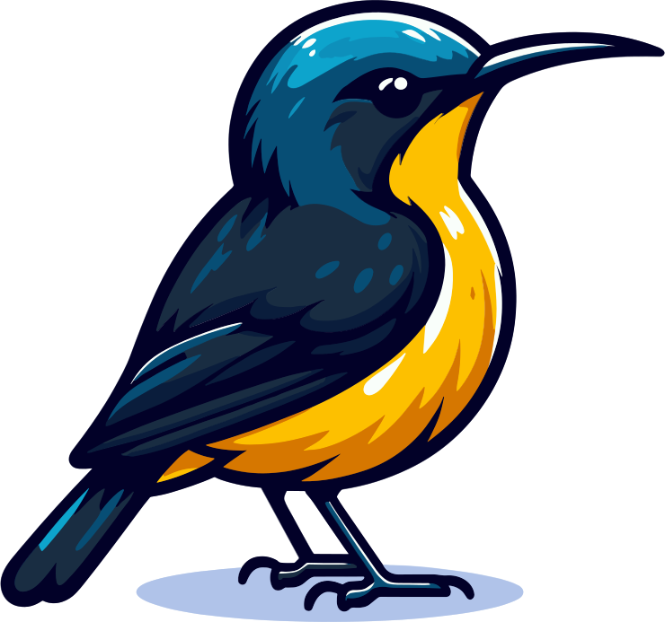

<div align=center>


# Marungu Sunbird


</div>

> The marungu sunbird is a rare and endangered nectar-feeding bird that is only found in a small forest in the Marungu highlands of Congo. It is named after the Belgian ornithologist Alexandre Prigogine who discovered it in 1955. It is threatened by habitat loss, hunting, and trapping. The entire population is estimated to be less than 2500 individuals.

**Sunbird** is a fast and lightweight web interface for the TeamSpeak ServerQuery API. It is built with [ts3-query-api](https://github.com/Brabb3l/ts3-query-api) and [Rocket](https://rocket.rs/) using [Rust](https://www.rust-lang.org/). **Sunbird** supports basic query operations and advanced features such as channel augmentation. If you find this project useful, please consider giving it a star on [GitHub](https://github.com/Gamer92000/marungusunbird/star).

# 🚀 Quickstart

A minimal Docker image is provided for maximum compatibility. It is based on Alpine Linux and contains only the bare minimum to run **Sunbird**. It is compiled for the `x86_64` architecture using the latest stable Rust compiler.

## 🐳 Docker

To simply run the image, you can use the following command:

```bash
docker run -d --name sunbird -p "8000:8000" ghcr.io/gamer92000/marungusunbird:latest
```

If you want to use a configuration file, you can mount it to `/app/config.toml`:

```bash
docker run -d --name sunbird -p "8000:8000" -v "/path/to/config.toml:/app/config.toml" ghcr.io/gamer92000/marungusunbird:latest
```

<!-- docker compose -->
Alternatively, you can use [Docker Compose](https://docs.docker.com/compose/). A sample [`docker-compose.yml`](docker-compose.yml) file is provided in the repository. To use it, run the following command:

```bash
docker compose up -d
```

<!-- Config -->
## ⚙️ Configuration

The configuration can be done by either using environment variables or mounting a configuration file. The configuration file is located at `/app/config.toml` and is in the [TOML](https://toml.io/en/) format. The following options are available:

```toml
# TeamSpeak Query
host = "127.0.0.1"     # The IP address of the TeamSpeak server
port = 10011           # The port of the Telnet Query interface
user = "serveradmin"   # The username of the query user
pass = "password"      # The password of the query user
vsid = 1               # The virtual server ID to use
# Web interface
bind_addr = "0.0.0.0"  # The IP address to bind the web server to
bind_port = 8000       # The port to bind the web server to
```

# 🛠️ Compile

If you want to compile the application yourself, you need to have the Rust toolchain installed. You can find a guide [here](https://www.rust-lang.org/tools/install). It is recommended to keep the toolchain up to date with `rustup update`.
```bash

git clone git@github.com:gamer92000/marungusunbird.git
cd marungusunbird
cargo build --release
```

The compiled binary can be found at `target/release/marungu_sunbird`.

# 📄 License

This project is licensed under the MIT License - see the [LICENSE](LICENSE) file for details.